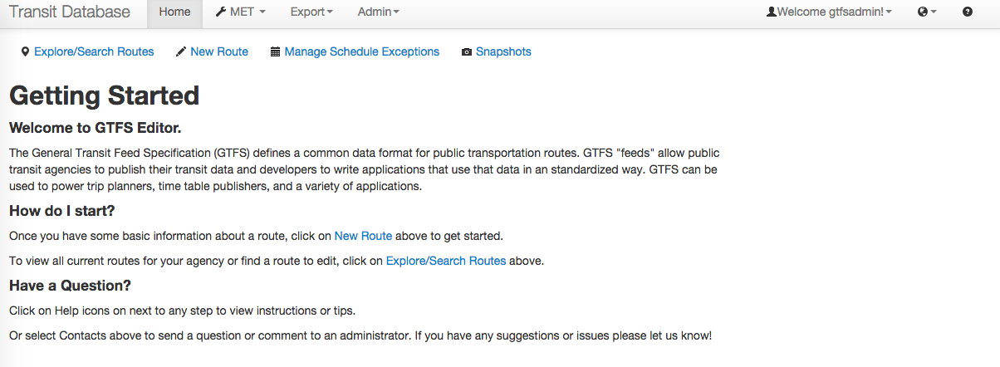

# GTFS Editor Installation



## Generic Ubuntu

If you just want to install the GTFS Editor on a generic Ubuntu machine, you can just execute [this script](cloudfront/install.sh):

```
#!/bin/bash -xe
sudo apt-get --yes update
sudo apt-get --yes install git unzip openjdk-7-jre
wget http://downloads.typesafe.com/releases/play-1.2.5.zip
unzip play-1.2.5.zip
git clone https://github.com/conveyal/gtfs-editor.git
cd gtfs-editor
cp conf/application.conf.template conf/application.conf
../play-1.2.5/play dependencies
../play-1.2.5/play run
```

## Ubuntu on Amazon AWS

To install the GTFS Editor you have two options described here:

* You can install it [from scratch](docs/Install.md) creating a new VM.

* Or you can simplify the process [using Amazon CloudFormation](docs/Install_CloudFormation.md).

We have created [installation scripts](cloudformation/) to make this process as straightforward as possible.

## Next steps

In order to test the instance we've included some information on how to import some popular GTFS feeds:

* [Importing a GTFS feed](docs/Import.md).

You can see the results in [these screenshots](docs/Screenshots.md)
